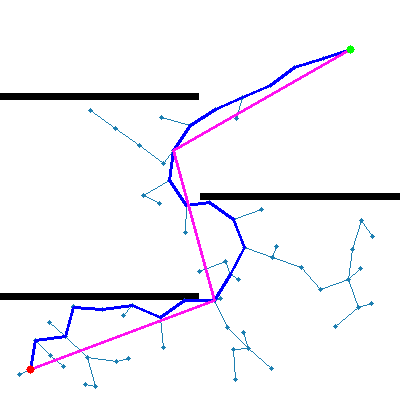
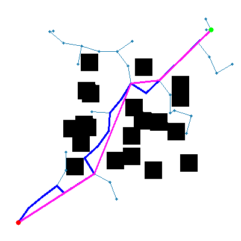

Sampling-based Path Planning Algorithms
==============

Sampling-based path planning algorithms, such as Rapidly-exploring Random Trees (RRT) and RRT*, are widely used in robotics and motion planning to find feasible paths in high-dimensional and complex environments. In this repository, several sampling-based algorithms are implemented with simple grid environment.

Version
-----

* OpenCV >- 4.0.0 (for visualization)
* C++ >= 11

Details
-----

* For fast collision checking, Bresenham's algorithm is used.
* Naive nearest searching is applied in code. You can more optimize this code with KD-tree or extra.
* Blue line is an initial path computed by sampling-based algorithms and pink line is a post-processed path.
* Another sampling-based path planning algorithms will be uploaded.

About RRT algorithm
-----

### RRT


### RRT-Connect



How to use
-----

    ```
    $ git clone https://github.com/kangbeenlee/sampling-based-algorithms-cpp.git
    $ cd sampling-based-algorithms-cpp
    $ cd (Any directory what you wanna implement e.g. rrt, rrt_connect, ...)
    $ mkdir build && cd build
    $ cmake .. && make
    $ ./planner
    ```

Reference
-----
 
[1] [Bresenham's algorithm](http://members.chello.at/~easyfilter/bresenham.html).   
[2] [RRT](): LaValle et al., Rapidly-Exploring Random Trees: A New Tool for Path Planning, 1998   
[2] [RRT-Connect](http://www.cs.cmu.edu/afs/andrew/scs/cs/15-494-sp13/nslobody/Class/readings/kuffner_icra2000.pdf): LaValle et al., An Efficient Approach to Single-Query Path Planning, 2000   