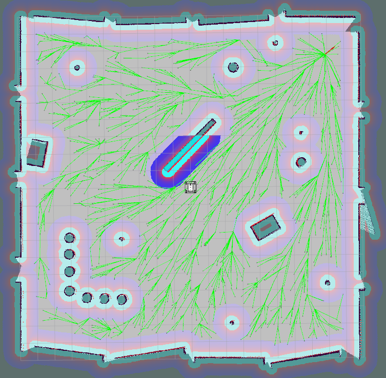

rrtx_global_planner
==============

Global path planner plugin based on RRTX algorithm for move_base package

About
-----

This package provides global path planner plugin based on [RRTX algorithm](http://ottelab.com/html_stuff/pdf_files/Otte.Frazzoli.IJRR15.pdf) for [move_base](http://wiki.ros.org/move_base) package.
The move_base package supports any global planner adhering to the nav_core::BaseGlobalPlanner interface specified in the nav_core package.
RRTx is an asymptotically optimal sampling-based replanning algorithm for dynamic environments where the obstacles unpredictably appears, disappears, or moves [1].

Reference
-----

[1] RRTX: Asymptotically Optimal Single-Query Sampling-Based Motion Planning with Quick Replanning. Michael Otte and Emilio Frazzoli. The International Journal of Robotics Research. Volume 29, Issue 7. 2016. p. 797-822.

[2] [RRTX code with the Julia programming language by Michael Otte](http://ottelab.com/html_stuff/code.html).